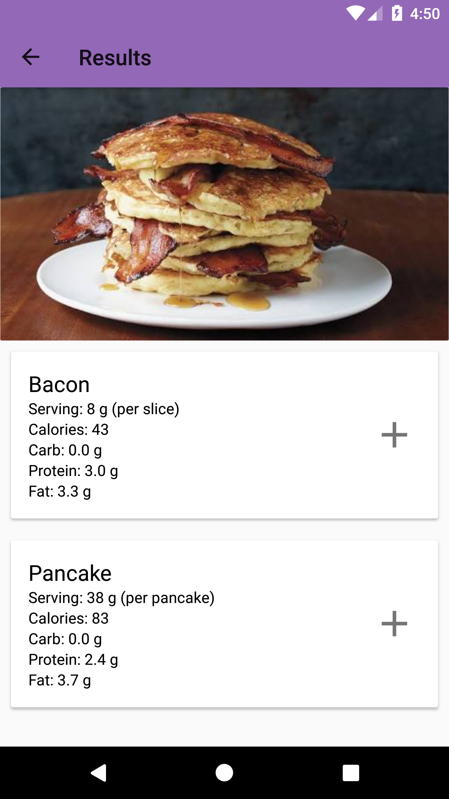
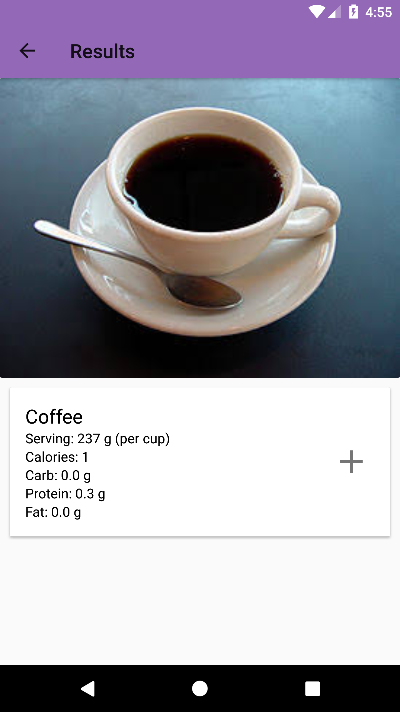
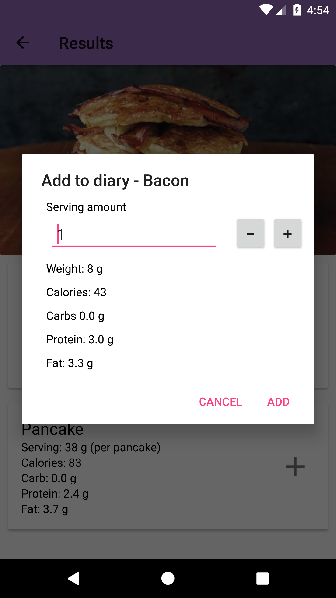
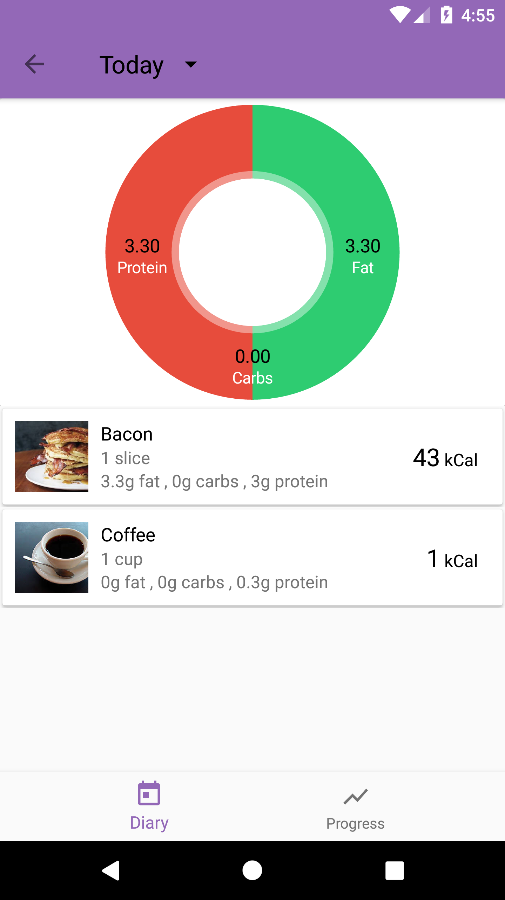
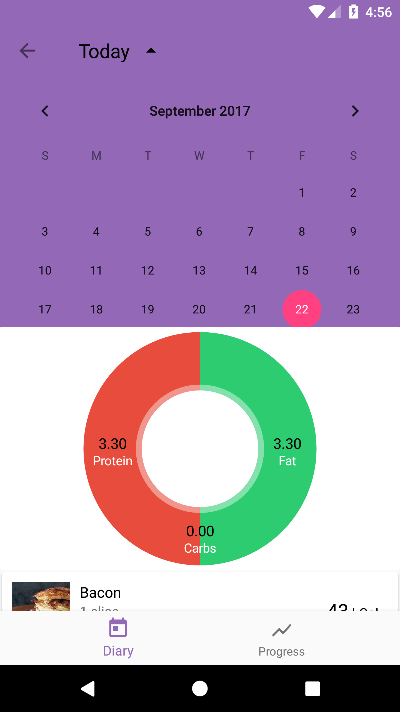

# NutriSnap

NutriSnap is an Android app that lets users snap a food photo and get the nutritional information of the meal. The app also allows  users to save their foods to diary and provides a visualized analysis of their eating habits.

The image recognition was implemented by convolutional neural network. The model was developed with TensorFlow and trained with over 100,000 images.

## Getting Started

### Prerequisites
- Java Development Kit: https://docs.oracle.com/javase/8/docs/technotes/guides/install/install_overview.html
- Android Studio: https://developer.android.com/studio/index.html

### Usage

1. Clone the project

```
git clone https://github.com/okascout/NutriSnap.git
```

2. Import the project to Android Studio

```
cd NutriSnap
studio .
```
3. From there you can either run it with an emulator or your own android device

## Screenshots

### Main screen


### Food recognition

  

### Diary
 
